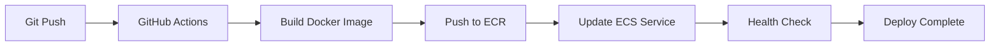

##  文書情報

- **作成日**: 2025-08-23
- **バージョン**: v1.0
- **作成者**: Rin Nakahata
- **最終更新**: 2025-08-23

---

##  プロジェクト概要

### 目的
AWSインフラ構築スキルを証明するポートフォリオ作成

### 成果物
- 実動するAWSインフラストラクチャ
- インフラのコード化（Terraform）
- ドキュメント一式
- GitHub公開プロジェクト

---

##  システムアーキテクチャ

### 全体構成

```
┌──────────────┐    ┌──────────────┐    ┌──────────────┐    ┌──────────────┐
│   Internet   │───▶│  CloudFront  │───▶│      S3      │    │     User     │
│   Gateway    │    │  (CDN/Cache) │    │ (Static Web) │    │  Interface   │
└──────────────┘    └──────────────┘    └──────────────┘    └──────────────┘
                                                                      │
                                                                      ▼
┌──────────────┐    ┌──────────────┐    ┌──────────────┐    ┌──────────────┐
│    Route53   │───▶│   ALB/ELB    │───▶│ ECS/Fargate  │───▶│   DynamoDB   │
│    (DNS)     │    │Load Balancer │    │Python API App│    │  (Database)  │
└──────────────┘    └──────────────┘    └──────────────┘    └──────────────┘
                                                │
                                                ▼
                                    ┌──────────────┐
                                    │  CloudWatch  │
                                    │ (Monitoring) │
                                    └──────────────┘
```

### コンポーネント詳細

#### フロントエンド層
- **Amazon S3**: 静的Webコンテンツホスティング
- **CloudFront**: CDNによる高速配信とキャッシュ
- **Route53**: DNS管理（オプション）

#### アプリケーション層
- **Application Load Balancer (ALB)**: トラフィック分散
- **Amazon ECS/Fargate**: コンテナオーケストレーション
- **Python アプリケーション**: Flask/FastAPI による RESTful API

#### データ層
- **Amazon DynamoDB**: NoSQLデータベース
- **Amazon S3**: ファイル・画像ストレージ

#### 運用・監視層
- **Amazon CloudWatch**: メトリクス監視・ログ管理
- **AWS CloudTrail**: API監査ログ（オプション）

---

##  ネットワーク設計

### VPC構成

```
VPC (10.0.0.0/16)
├── Public Subnet A (10.0.1.0/24) - AZ: ap-northeast-1a
│   ├── ALB
│   └── NAT Gateway
├── Public Subnet B (10.0.2.0/24) - AZ: ap-northeast-1c
│   └── ALB
├── Private Subnet A (10.0.11.0/24) - AZ: ap-northeast-1a
│   └── ECS Tasks
└── Private Subnet B (10.0.12.0/24) - AZ: ap-northeast-1c
    └── ECS Tasks
```

### セキュリティグループ

#### ALB Security Group
```
Inbound:
  - HTTP (80): 0.0.0.0/0
  - HTTPS (443): 0.0.0.0/0
Outbound:
  - All traffic: 0.0.0.0/0
```

#### ECS Security Group
```
Inbound:
  - Custom TCP (8000): ALB Security Group
Outbound:
  - All traffic: 0.0.0.0/0
```

---

##  コンテナ設計

### Docker構成

#### アプリケーションコンテナ
- **ベースイメージ**: python:3.11-slim
- **アプリケーション**: Flask/FastAPI
- **ポート**: 8000
- **ヘルスチェック**: `/health` エンドポイント

#### ECSタスク定義
```json
{
  "family": "portfolio-api",
  "taskRoleArn": "arn:aws:iam::account:role/ecsTaskRole",
  "networkMode": "awsvpc",
  "requiresCompatibilities": ["FARGATE"],
  "cpu": "256",
  "memory": "512",
  "containerDefinitions": [
    {
      "name": "api-container",
      "image": "account.dkr.ecr.region.amazonaws.com/portfolio-api:latest",
      "portMappings": [
        {
          "containerPort": 8000,
          "protocol": "tcp"
        }
      ],
      "essential": true,
      "logConfiguration": {
        "logDriver": "awslogs",
        "options": {
          "awslogs-group": "/aws/ecs/portfolio-api",
          "awslogs-region": "ap-northeast-1",
          "awslogs-stream-prefix": "ecs"
        }
      }
    }
  ]
}
```

---

##  データベース設計

### DynamoDB テーブル設計

#### Users テーブル
```
Table Name: portfolio-users
Partition Key: user_id (String)
Attributes:
  - user_id: ユーザーID
  - username: ユーザー名
  - email: メールアドレス
  - created_at: 作成日時
  - updated_at: 更新日時
```

#### Metrics テーブル (IoTシミュレーション用)
```
Table Name: portfolio-metrics
Partition Key: device_id (String)
Sort Key: timestamp (Number)
Attributes:
  - device_id: デバイスID
  - timestamp: タイムスタンプ
  - temperature: 温度
  - humidity: 湿度
  - status: ステータス
```

---

##  デプロイ戦略

### CI/CD パイプライン



### デプロイフロー
1. **コードプッシュ**: GitHubへのプッシュ
2. **ビルド**: Docker イメージビルド
3. **レジストリプッシュ**: ECR へのイメージプッシュ
4. **サービス更新**: ECS サービス更新
5. **ヘルスチェック**: アプリケーション稼働確認

---

##  監視・運用

### CloudWatch メトリクス

#### インフラメトリクス
- ECS CPU/メモリ使用率
- ALB リクエスト数・レスポンス時間
- DynamoDB 読み書きキャパシティ

#### アプリケーションメトリクス
- API エンドポイント別レスポンス時間
- エラー率
- スループット

### ログ管理
- ECS タスクログ → CloudWatch Logs
- ALB アクセスログ → S3
- アプリケーションログ → CloudWatch Logs

---

##  コスト設計

### 無料利用枠の活用

| サービス | 無料利用枠 | 想定使用量 |
|---------|-----------|-----------|
| ECS | 無料 (Fargate有料) | 最小構成 |
| DynamoDB | 25GB/月 | < 1GB |
| CloudWatch | 10メトリクス | 基本メトリクスのみ |
| S3 | 5GB | 静的ファイル用 |
| ALB | 750時間/月 | 常時稼働 |

### 想定月額コスト
- **開発期間中**: $10-20/月
- **デモ期間**: $5-10/月

---

##  セキュリティ設計

### IAM ポリシー設計
- 最小権限の原則
- サービス固有のロール分離
- 開発・本番環境の分離

### ネットワークセキュリティ
- Private Subnet での ECS 実行
- セキュリティグループによる通信制御
- NACLs による追加制御（必要に応じて）

### データ保護
- DynamoDB暗号化 (KMS)
- S3 バケット暗号化
- CloudWatch Logs 暗号化

---

##  参考資料

- [AWS Well-Architected Framework](https://aws.amazon.com/architecture/well-architected/)
- [AWS ECS Best Practices](https://docs.aws.amazon.com/AmazonECS/latest/bestpracticesguide/)
- [Terraform AWS Provider](https://registry.terraform.io/providers/hashicorp/aws/latest/docs)

---

**次回更新予定**: システム要件定義完了後
