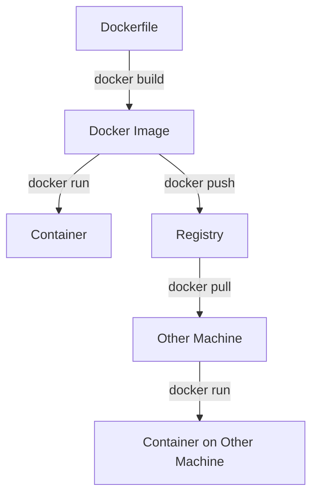

# Docker基礎概念 学習資料

##  文書情報

- **作成日**: 2025-08-23
- **バージョン**: v1.0
- **対象**: Docker初心者〜中級者
- **作成者**: Rin Nakahata
- **最終更新**: 2025-08-23

---

##  学習目標

この資料を読むことで以下を理解できます：
1. Dockerとは何か、なぜ必要なのか
2. Dockerの基本概念（イメージ、コンテナ、レジストリ）
3. Dockerの基本コマンドの使い方
4. 開発・本番環境でのDocker活用方法

---

##  Dockerとは？

### 問題：従来の環境の課題
```
開発者のPC: Python 3.9 + ライブラリA v1.0
本番サーバー: Python 3.8 + ライブラリA v0.9
テスト環境: Python 3.10 + ライブラリA v1.1

結果：「私の環境では動くのに...」
```

### 解決：Dockerによる環境の統一
```
開発者のPC: Docker Container (Python 3.9 + ライブラリA v1.0)
本番サーバー: 同じ Docker Container
テスト環境: 同じ Docker Container

結果：どこでも同じ環境で実行可能
```

### Dockerの定義
**Docker**: アプリケーションとその実行環境をパッケージ化し、どこでも同じように動かせるコンテナ技術

---

##  Dockerの基本概念

### 1. イメージ (Image)
**アプリケーションのテンプレート**

```
┌─────────────────┐
│   Docker Image  │
│                 │
│ ┌─────────────┐ │
│ │   Python    │ │ ← プログラミング言語
│ └─────────────┘ │
│ ┌─────────────┐ │
│ │ FastAPI App │ │ ← アプリケーション
│ └─────────────┘ │
│ ┌─────────────┐ │
│ │Dependencies │ │ ← ライブラリ・依存関係
│ └─────────────┘ │
└─────────────────┘
```

**特徴:**
- 読み取り専用のテンプレート
- レイヤー構造で効率的
- DockerHubなどのレジストリで共有可能

### 2. コンテナ (Container)
**イメージから起動した実行環境**

```
Docker Image → Docker Container
（設計図）      （実際の建物）

┌─────────────┐    docker run    ┌─────────────┐
│   Image     │ ──────────────→  │ Container   │
│             │                  │             │
│ Python App  │                  │ Python App  │
│             │                  │ (Running)   │
└─────────────┘                  └─────────────┘
```

**特徴:**
- イメージから起動される実行インスタンス  
- 実行中のプロセス + ファイルシステム
- 起動・停止・削除が可能
- 独立したプロセス空間

### 3. レジストリ (Registry)
**イメージの保存・共有場所**

```
┌─────────────┐    push    ┌─────────────┐    pull    ┌─────────────┐
│ Developer   │ ─────────→ │ Docker Hub  │ ←───────── │   Server    │
│             │            │             │            │             │
│   Image     │            │   Image     │            │   Image     │
│             │            │ Repository  │            │             │
└─────────────┘            └─────────────┘            └─────────────┘
```

**主要なレジストリ:**
- **Docker Hub**: パブリックレジストリ
- **Amazon ECR**: AWSのプライベートレジストリ
- **GitHub Container Registry**: GitHubのコンテナレジストリ

---

##  Dockerの動作フロー

### 基本的な流れ
```
1. Dockerfile作成
   ↓
2. docker build (イメージ作成)
   ↓  
3. docker run (コンテナ起動)
   ↓
4. アプリケーション実行
```

### 詳細フロー


---

##  基本コマンド

### 1. イメージ操作

#### イメージの検索・取得
```bash
# Docker Hubでイメージ検索
docker search python

# イメージをダウンロード
docker pull python:3.11-slim

# ローカルイメージ一覧表示
docker images

# イメージ削除
docker rmi python:3.11-slim
```

#### イメージのビルド
```bash
# Dockerfileからイメージ作成
docker build -t myapp:latest .

# タグ付きでビルド  
docker build -t myapp:v1.0 .

# 特定のDockerfileを指定
docker build -f Dockerfile.prod -t myapp:prod .
```

### 2. コンテナ操作

#### コンテナの実行
```bash
# バックグラウンドで実行
docker run -d --name mycontainer myapp:latest

# ポート公開
docker run -d -p 8000:8000 --name api-server myapp:latest

# 環境変数指定
docker run -d -e ENV=production --name prod-app myapp:latest

# ボリュームマウント
docker run -d -v /host/data:/app/data myapp:latest
```

#### コンテナの管理
```bash
# 実行中のコンテナ一覧
docker ps

# 全コンテナ一覧（停止中含む）
docker ps -a

# コンテナ停止
docker stop mycontainer

# コンテナ再起動
docker restart mycontainer

# コンテナ削除
docker rm mycontainer

# 強制削除
docker rm -f mycontainer
```

### 3. デバッグ・調査

#### コンテナ内部操作
```bash
# コンテナ内でコマンド実行
docker exec -it mycontainer bash

# コンテナ内でワンライナー実行
docker exec mycontainer ls -la

# コンテナのログ確認
docker logs mycontainer

# リアルタイムログ確認
docker logs -f mycontainer
```

#### コンテナ情報確認
```bash
# コンテナ詳細情報
docker inspect mycontainer

# コンテナのプロセス確認
docker top mycontainer

# リソース使用状況
docker stats mycontainer
```

---

##  実践例：Python APIアプリ

### 1. サンプルアプリケーション

#### app.py
```python
from fastapi import FastAPI
import os

app = FastAPI()

@app.get("/")
def read_root():
    return {"message": "Hello Docker World!", "env": os.getenv("ENV", "development")}

@app.get("/health")
def health_check():
    return {"status": "healthy"}

if __name__ == "__main__":
    import uvicorn
    uvicorn.run(app, host="0.0.0.0", port=8000)
```

#### requirements.txt
```
fastapi==0.104.1
uvicorn==0.24.0
```

### 2. Dockerfile作成
```dockerfile
FROM python:3.11-slim

WORKDIR /app

COPY requirements.txt .
RUN pip install --no-cache-dir -r requirements.txt

COPY app.py .

EXPOSE 8000

CMD ["uvicorn", "app:app", "--host", "0.0.0.0", "--port", "8000"]
```

### 3. ビルド・実行
```bash
# イメージビルド
docker build -t python-api:latest .

# コンテナ実行
docker run -d -p 8000:8000 --name api-server python-api:latest

# 動作確認
curl http://localhost:8000
curl http://localhost:8000/health

# コンテナ停止・削除
docker stop api-server
docker rm api-server
```

---

##  Dockerの利点

### 1. 環境の一致性
```
開発環境 = ステージング環境 = 本番環境
→ 「動かない」問題の解決
```

### 2. 高速なデプロイ
```
従来: OS起動 → 依存関係インストール → アプリ起動 (数分)
Docker: コンテナ起動 → アプリ起動 (数秒)
```

### 3. リソース効率
```
VM: 各環境にOS必要 → 重い
Docker: OS共有 → 軽い

┌─────────────────────────────────┐
│           Host OS               │
├─────────────┬─────────────┬─────┤
│ Container 1 │ Container 2 │ ... │
│   App A     │   App B     │     │
└─────────────┴─────────────┴─────┘
```

### 4. スケーラビリティ
```bash
# 簡単にスケールアウト
docker run -d --name api-1 python-api:latest
docker run -d --name api-2 python-api:latest  
docker run -d --name api-3 python-api:latest
```

---

##  Dockerの注意点・制限

### 1. データの永続化
```
コンテナ削除 → データ消失
解決策: ボリューム (Volume) 使用
```

### 2. ネットワーク設定
```
デフォルト: 他のコンテナと通信不可
解決策: Docker Network作成
```

### 3. セキュリティ
```
コンテナ = 完全な隔離ではない
対策: 最小権限、rootユーザー避ける
```

### 4. ファイルサイズ
```
不適切な設定 → 巨大なイメージ
対策: マルチステージビルド、.dockerignore
```

---

##  本プロジェクトでの活用

### 1. 開発環境
```bash
# ローカル開発
docker run -d -p 8000:8000 \
  -v $(pwd):/app \
  --name dev-api \
  python-api:dev
```

### 2. CI/CD
```bash
# GitHub Actionsでのビルド・テスト
docker build -t api:$GITHUB_SHA .
docker run --rm api:$GITHUB_SHA pytest
```

### 3. AWS ECS/Fargate
```bash
# ECRにプッシュ
docker tag api:latest xxxx.dkr.ecr.ap-northeast-1.amazonaws.com/portfolio-api:latest
docker push xxxx.dkr.ecr.ap-northeast-1.amazonaws.com/portfolio-api:latest
```

---

##  次のステップ

この基礎を理解したら、以下を学習：

1. **Dockerfile作成方法** → 効率的なイメージ作成
2. **docker-compose** → 複数コンテナの管理
3. **ベストプラクティス** → プロダクション対応

---

##  参考リソース

### 公式ドキュメント
- [Docker公式ドキュメント](https://docs.docker.com/)
- [Docker Hub](https://hub.docker.com/)

### 学習リソース
- [Docker入門](https://docs.docker.jp/)
- [Play with Docker](https://labs.play-with-docker.com/)

---

##  変更履歴

| バージョン | 日付 | 変更内容 |
|------------|------|----------|
| 1.0.0 | 2025-08-23 | 初版作成 |

---

**次回学習**: Dockerfile記述方法
